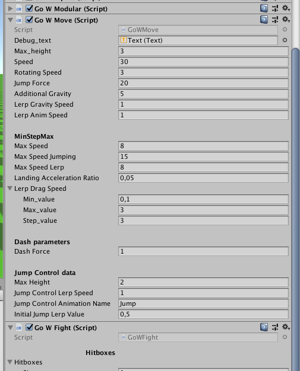

# Files used in God of War: ReMehd

* Scripts 
* Animator
* State Machine Behaviour 
* Currently used values 

### 25/08 Update

1. **HitData**: A struct used to hold informations on hits. I create a public instance of this struct in each animation state featuring a hit. Data currently consists of 
    * Hitbox name 
    * Impulsion force: How much speed this hit adds to the character rb.velocity. **Useful tips**: Backward force to stop sliding 
    * Impact force: How much force is transmitted to the ennemy on hit 
1. When entering a hit animation state, **HitInfo** state behaviour calls the ModularScript to transmit the corresponding hit info data. This is then passed on to the corresponding hitbox. In case of an impact, the impacted hitbox reads the HitData informations which allows then force application and so on. 
1. Currently, direction of the force is the hitting character forward. **Idea**: Set a vector in the animation hit data to precise hit direction. 

## Important notes 
1. In **GoWFight**: The end of the file contains several structs used through the various scripts. Notably HitData
1. The new `CheckMaxSpeed` in **GoWMove** focuses only on horizontal speed. Better results. 
1. Some values I used for the movement script: 

